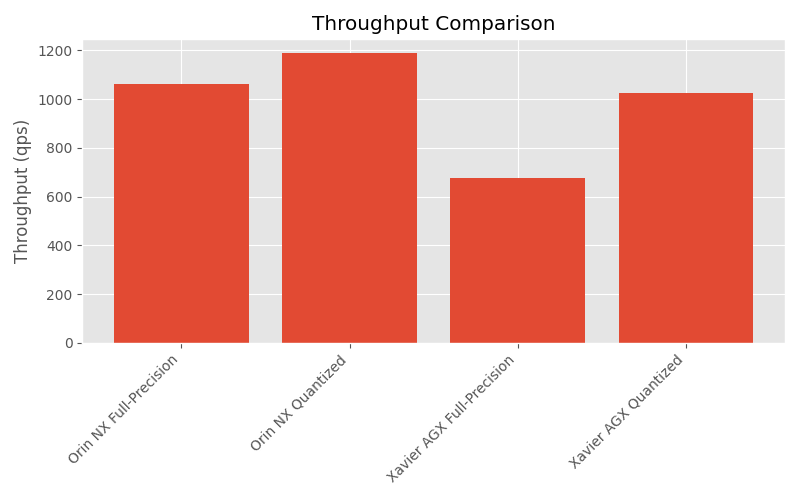

 # MobileNetV2 TensorRT Benchmark and Profiling

This repository provides tools to export PyTorch MobileNetV2 models (FP32 and INT8) to ONNX, benchmark them with TensorRT on NVIDIA Jetson devices (Orin NX and Xavier AGX), profile per-layer performance, and generate summary tables and plots.

 ## Table of Contents
 - [Overview](#overview)
 - [Prerequisites](#prerequisites)
 - [Export ONNX Models](#export-onnx-models)
 - [Benchmark with TensorRT](#benchmark-with-tensorrt)
 - [Generate Per-Layer Profile Table](#generate-per-layer-profile-table)
 - [Generate Plots](#generate-plots)
 - [Data Structure](#data-structure)
 - [Example Outputs](#example-outputs)
 - [Contributing](#contributing)

 ## Overview
 1. `export_torch_mobilenet_onnx.py`  
    Export MobileNetV2 (FP32 or quantized INT8) from PyTorch to ONNX.
 2. `trtexec_results.py`  
    Contains summary benchmarking results (throughput, latency, etc.) for both precisions on both devices.
 3. `profiles_table.py`  
    Loads detailed per-layer profiling JSONs and prints the top-10 INT8 speedups versus FP32.
 4. `data_plots.py`  
    Reads `trtexec_results.py` data to generate bar charts (throughput, latencies, timings) saved under `img/`.

 ## Prerequisites
 - Python 3.8+
 - PyTorch & torchvision
 - pandas
 - matplotlib
 - NVIDIA TensorRT SDK (and `trtexec` in PATH)
 - CUDA-enabled NVIDIA Jetson device (Orin NX, Xavier AGX)

 Install Python dependencies:
 ```bash
 pip install torch torchvision pandas matplotlib
 ```

 ## Export ONNX Models
 Generate FP32 ONNX:
 ```bash
 python export_torch_mobilenet_onnx.py --output mobilenetv2_fp32.onnx
 ```
 Generate INT8 (quantized) ONNX:
 ```bash
 python export_torch_mobilenet_onnx.py --quantized --output mobilenetv2_int8.onnx
 ```

 ## Benchmark with TensorRT
 Run `trtexec` to build engines and collect summary metrics:
 ```bash
 trtexec --onnx=mobilenetv2_fp32.onnx \
         --saveEngine=data/mobilenetv2_fp32.trt \
         --exportTimingProfile=data/orin_nx/mobilenetv2_fp32_profile.json
 ```
 Repeat for `mobilenetv2_int8.onnx` and for each device by adjusting output paths under `data/{orin_nx,xavier_agx}`. Use the `--int8` flag to benchmark the quantized model. 

 ## Generate Per-Layer Profile Table
 ```bash
 python profiles_table.py
 ```
 Prints the top-10 layers with highest INT8 speedup per device.

 ## Generate Plots
 ```bash
 python data_plots.py
 ```
 Saves bar charts under `img/`:
 - `throughput_comparison.png`
 - `mean_latency_comparison.png`
 - `gpu_compute_time_comparison.png`
 - `enqueue_time_comparison.png`
 - `h2d_latency_comparison.png`
 - `d2h_latency_comparison.png`
 - `total_gpu_compute_time.png`
 - `total_host_walltime.png`

 ## Data Structure
 ```
 .
 ├── data/
 │   ├── mobilenetv2_fp32.trt
 │   ├── orin_nx/
 │   │   ├── mobilenetv2_fp32_profile.json
 │   │   └── mobilenetv2_int8_profile.json
 │   └── xavier_agx/
 │       ├── mobilenetv2_fp32_profile.json
 │       └── mobilenetv2_int8_profile.json
 ├── img/  # generated plots
 ├── export_torch_mobilenet_onnx.py
 ├── profiles_table.py
 ├── trtexec_results.py
 └── data_plots.py
 ```

 ## Example Outputs
 

 ## Contributing
 PRs and issues welcome! Please follow the standard GitHub flow.

